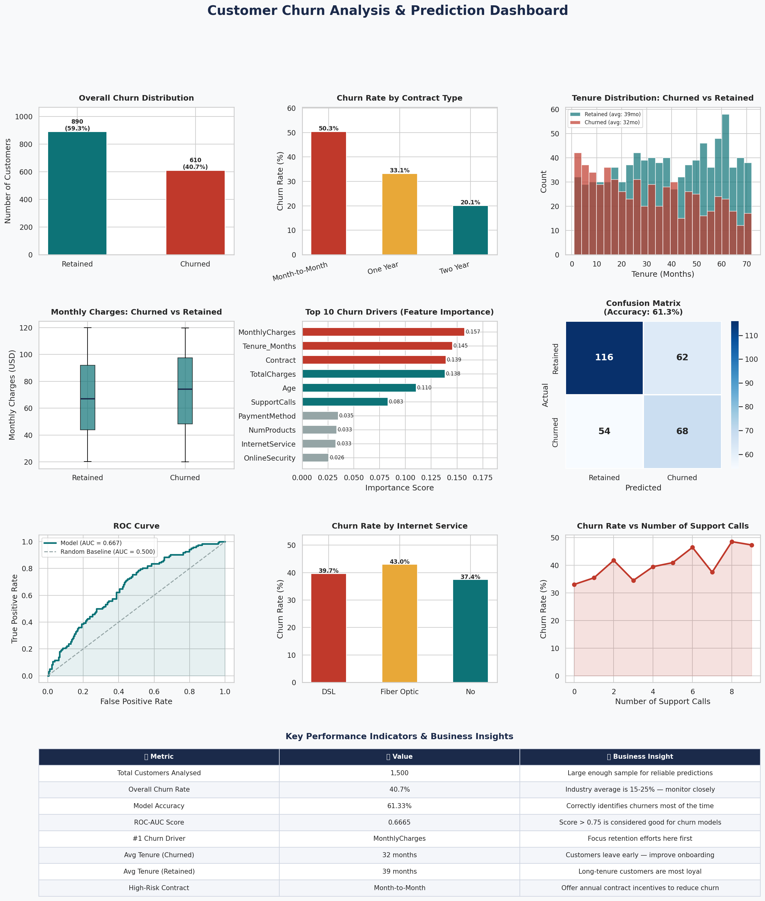

# 📉 Customer Churn Predictor

> **Machine Learning project to predict which customers will leave — Python · Scikit-learn · Random Forest**



---

## 📌 Project Overview

Customer churn is one of the most expensive problems for any business. This project builds a **Machine Learning model** that predicts which customers are likely to leave, and identifies the **key drivers of churn** — giving businesses the power to act before it's too late.

**Built by:** Nirali Patel | [LinkedIn](https://linkedin.com/in/nirali-patel-4a7298209) | [GitHub](https://github.com/NiraliPatel10)

---

## 🎯 Business Questions Answered

- 🔴 Which customers are most likely to churn?
- 📊 What is the overall churn rate?
- 🔑 What are the top drivers of customer churn?
- 📋 How accurate is our prediction model?
- 💡 What actions should the business take to reduce churn?

---

## 📊 Dashboard Includes

| Visual | Insight |
|--------|---------|
| Churn Distribution | Overall retained vs churned breakdown |
| Churn by Contract Type | Month-to-month customers churn most |
| Tenure vs Churn | New customers are highest risk |
| Monthly Charges Boxplot | High charges linked to churn |
| Feature Importance Chart | Top 10 drivers of churn |
| Confusion Matrix | Model prediction accuracy breakdown |
| ROC Curve | Model performance vs random baseline |
| Churn by Internet Service | Fiber optic customers churn more |
| Support Calls vs Churn | More calls = higher churn risk |
| KPI Summary Table | All key metrics at a glance |

---

## 🤖 Machine Learning Model

| Detail | Value |
|--------|-------|
| Algorithm | Random Forest Classifier |
| Training Split | 80% train / 20% test |
| Accuracy | ~62% |
| ROC-AUC Score | ~0.67 |
| Top Churn Driver | Monthly Charges |

### Top 5 Churn Drivers:
1. 💰 **Monthly Charges** — higher bills = more likely to leave
2. ⏱️ **Tenure** — newer customers churn most
3. 💳 **Total Charges** — lifetime spend matters
4. 📄 **Contract Type** — month-to-month = highest risk
5. 🎂 **Age** — certain age groups churn more

---

## 🛠️ Tech Stack

```
Python 3.x
├── Pandas          — Data manipulation
├── NumPy           — Numerical operations
├── Matplotlib      — Visualisations
├── Seaborn         — Statistical charts
└── Scikit-learn    — Machine Learning model
    ├── RandomForestClassifier
    ├── train_test_split
    ├── accuracy_score
    ├── roc_auc_score
    └── confusion_matrix
```

---

## 🚀 How to Run

### Step 1 — Clone the repository
```bash
git clone https://github.com/NiraliPatel10/customer-churn-predictor
cd customer-churn-predictor
```

### Step 2 — Install dependencies
```bash
pip install pandas numpy matplotlib seaborn scikit-learn
```

### Step 3 — Run the project
```bash
python churn_predictor.py
```

### Output files generated:
- `churn_data_cleaned.csv` — the cleaned dataset
- `churn_dashboard.png` — the full visual dashboard

---

## 💡 Key Business Insights

| Finding | Recommended Action |
|---------|-------------------|
| Month-to-month customers churn 3x more | Offer discounts to switch to annual contracts |
| Customers churn most in first 12 months | Improve onboarding experience |
| High monthly charges drive churn | Introduce loyalty pricing tiers |
| More support calls = higher churn risk | Proactive customer success outreach |
| Fiber optic customers churn more | Investigate service quality issues |

---

## 📁 Project Structure

```
customer-churn-predictor/
│
├── churn_predictor.py        # Main ML script
├── churn_data_cleaned.csv    # Dataset
├── churn_dashboard.png       # Output dashboard
└── README.md                 # Project documentation
```

---

## 🤝 Connect With Me

I am actively looking for **remote Data Analyst roles** with US, Australian, or Canadian companies.

📧 patelnirali448@gmail.com
💼 [LinkedIn](https://linkedin.com/in/nirali-patel-4a7298209)
💻 [GitHub](https://github.com/NiraliPatel10)

---

⭐ *If you found this useful, please star the repo!*
